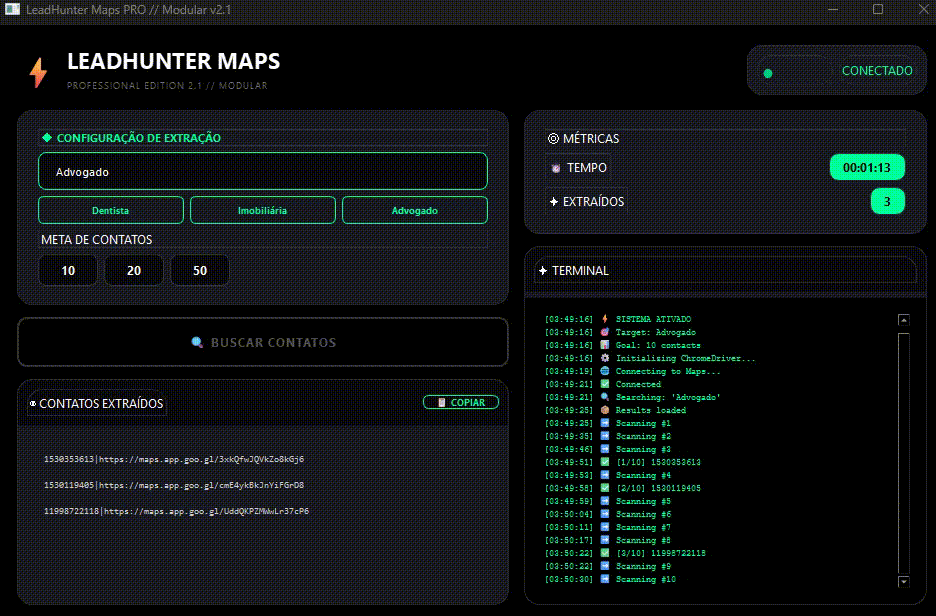

# ⚡ LeadHunter Maps PRO (v2.1)


**LeadHunter Maps PRO** é uma ferramenta desktop avançada de automação e extração de dados (leads) do Google Maps. Desenvolvido em Python com arquitetura modular, utiliza **PySide6** para uma interface moderna em Dark Mode e **Selenium** para navegação autônoma e coleta de dados.

---



---
## 🚀 Funcionalidades Principais

* **🔍 Busca Inteligente:** Pesquisa por nicho (ex: "Dentista", "Imobiliária") e localização.
* **🤖 Automação Headless:** O navegador roda em segundo plano (modo oculto) ou visível.
* **📱 Extração de Contatos:** Coleta números de telefone e resolve links curtos (`goo.gl`) para links completos.
* **🛡️ Sistema Anti-Bot:** Implementa delays aleatórios e comportamento humano para evitar bloqueios.
* **📋 Exportação Rápida:** Botão para copiar a lista limpa de contatos direto para a área de transferência.
* **🎨 Interface Dark Mode:** Design profissional, responsivo e focado na usabilidade.
* **⚡ Arquitetura Modular:** Código desacoplado (UI separada da Lógica) facilitando manutenção e escalabilidade.

---

## 📈 Casos de Uso Reais

O **LeadHunter Maps PRO** é ideal para profissionais que precisam criar listas de contatos segmentadas (Leads) de forma rápida e automatizada:

* **🏢 Prospecção B2B:** Vendedores que precisam encontrar empresas específicas (ex: "Indústrias em Curitiba", "Escritórios de Advocacia") para oferecer serviços.
* **🦷 Clínicas e Consultórios:** Representantes comerciais que vendem equipamentos ou insumos para dentistas, médicos e esteticistas.
* **🍔 Food Service:** Agências de marketing buscando restaurantes e deliveries para oferecer gestão de redes sociais ou tráfego pago.
* **🏘️ Imobiliário:** Corretores buscando parcerias com construtoras ou mapeando lançamentos em bairros específicos.
* **💻 Freelancers:** Desenvolvedores Web e Designers procurando pequenos comércios locais que ainda não possuem site ou identidade visual.

---

## 🛠️ Stack Tecnológico

* **Linguagem:** Python 3.10+
* **Interface Gráfica (GUI):** PySide6 (Qt for Python)
* **Web Scraping:** Selenium WebDriver
* **Gerenciamento de Driver:** Webdriver-Manager (instala o ChromeDriver automaticamente)
* **Variáveis de Ambiente:** Python-Dotenv

---

## 📂 Estrutura do Projeto

O projeto segue uma arquitetura modular profissional:

```text
LeadHunterPRO/
│
├── .env                   # Variáveis de ambiente (API Keys, configs sensíveis)
├── .gitignore             # Arquivos ignorados pelo Git
├── main.py                # 🚀 Ponto de entrada da aplicação
├── requirements.txt       # Lista de dependências
│
└── src/                   # Código Fonte
    ├── config.py          # Configurações globais e XPaths
    │
    ├── core/              # 🧠 Lógica de Negócio (Backend)
    │   ├── signals.py     # Sinais de comunicação (Threads <-> UI)
    │   └── worker.py      # Motor do Scraper (Selenium)
    │
    └── ui/                # 🎨 Interface de Usuário (Frontend)
        ├── styles.py      # Estilos CSS (QSS)
        ├── widgets.py     # Componentes customizados (Cards, Botões)
        └── window.py      # Janela Principal

```

## 🚀 Como Instalar e Executar

Siga este guia rápido para rodar o projeto na sua máquina:

### 1. Prepare o Ambiente
Certifique-se de ter o [Python 3.10+](https://www.python.org/downloads/) e o **Google Chrome** instalados.

### 2. Clone e Instale
Abra seu terminal (Git Bash, Powershell ou CMD) e rode:

```bash
# 1. Clone o repositório
git clone [https://github.com/joaocarpim/botBuscaNum.git]

# 2. Entre na pasta
cd LeadHunterPRO

# 3. Crie um ambiente virtual (Opcional, mas recomendado)
python -m venv venv
# No Windows ative com:
.\venv\Scripts\activate
# No Linux/Mac ative com:
source venv/bin/activate

# 4. Instale as dependências
pip install -r requirements.txt

```
### 3. Configure o arquivo .env
Certifique-se de ter o [Python 3.10+](https://www.python.org/downloads/) e o **Google Chrome** instalados.

Configure o arquivo .env:
Crie um arquivo chamado .env na raiz do projeto e adicione suas chaves (se necessário):

```bash
GOOGLE_API_KEY=sua_chave_aqui_se_houver
```

## ▶️ Como Usar
### Com o ambiente virtual ativado, execute o arquivo principal:

```bash
python main.py
```
A interface abrirá.

1. Digite o Nicho (ex: "Pizzaria em São Paulo").

2. Defina a Meta de Contatos (ex: 10, 20, 50).

3. Clique em 🔍 BUSCAR CONTATOS.

4. Acompanhe o log no terminal integrado da aplicação.


## ⚠️ Aviso Legal
Este software foi desenvolvido apenas para fins educacionais e de aprendizado sobre automação web e interfaces gráficas. O uso de bots para extração de dados deve respeitar os Termos de Serviço das plataformas alvo. O autor não se responsabiliza pelo uso indevido da ferramenta.


## 🤝 Contribuição

Contribuições são bem-vindas!

1. Faça um **Fork** do projeto.
2. Crie uma **Branch** para sua Feature:
```bash
   git checkout -b feat/IncrivelFeature
```
3. Faça o Commit:
```bash
git commit -m 'Add some IncrivelFeature'
```
4. Faça o Push:
```bash
git push origin feat/IncrivelFeature
```
5. Abra um Pull Request.

<p align="center">
Desenvolvido com 💙 por <a href="https://github.com/joaocarpim">joaocarpim</a>
</p>